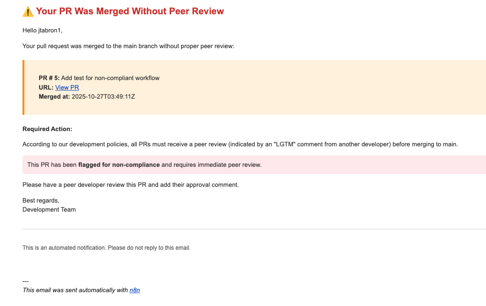
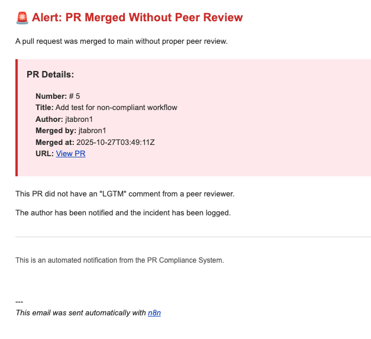
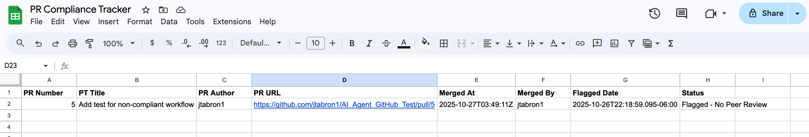

# PR Compliance Agent

> An automated n8n workflow that enforces peer review policies for GitHub pull requests, providing detective controls, audit trails, and accountability when branch protection rules are bypassed.

[](https://n8n.io)
[](LICENSE)
[](https://github.com)

## 🎯 Overview

The PR Compliance Agent is an intelligent automation that monitors GitHub pull requests merged to your main branch and ensures they receive proper peer review before merging. When a PR is merged without an "LGTM" (Looks Good To Me) comment from a reviewer other than the PR author, the agent automatically:

- 📊 **Logs the violation** to a centralized Google Sheets tracking spreadsheet
- 📧 **Notifies the developer** with a professional email explaining the policy violation
- 🚨 **Alerts leadership** with full context for organizational visibility
- 📈 **Enables reporting** for compliance audits and trend analysis

## 🎬 Demo

### Automated Email Notifications

**Developer Notification**  
When a PR is merged without peer review, the developer receives a clear, actionable email:



**Leadership Alert**  
Leadership receives detailed context about the violation for oversight:



### Automated Compliance Tracking

All violations are automatically logged to a Google Sheets tracking spreadsheet:



## 💡 Why This Matters

### The Problem: Branch Protection Isn't Enough

GitHub's branch protection rules are a critical first line of defense, but they have significant limitations:

#### 1. **Administrative Bypass**
- Repository administrators and organization owners can bypass branch protection rules
- During urgent hotfixes or production incidents, these bypasses are sometimes necessary
- But they create compliance gaps that go untracked

#### 2. **No Audit Trail**
- Branch protection prevents violations but doesn't *report* them
- When bypasses occur, there's no centralized log or notification system
- Compliance audits require manual investigation

#### 3. **Configuration Drift**
- Branch protection settings can be misconfigured or disabled across repositories
- In organizations with hundreds of repos, maintaining consistent policies is challenging
- A detective control provides a safety net regardless of individual repo settings

#### 4. **Cultural vs. Technical Enforcement**
- Hard blocks can be perceived as impediments during crises
- A "trust but verify" approach balances velocity with accountability
- Post-merge detection creates awareness without blocking critical work

### The Solution: Layered Defense

The PR Compliance Agent implements a **detective control** that works alongside preventive controls like branch protection:

```
Layer 1: Developer Training (awareness)
    ↓
Layer 2: Branch Protection (prevention)
    ↓
Layer 3: PR Compliance Agent (detection) ← You are here
    ↓
Layer 4: Weekly Reporting (oversight)
    ↓
Layer 5: Process Improvement (continuous improvement)
```

No single layer is perfect, but together they create comprehensive coverage.

## 🏢 Real-World Use Cases

### Financial Services & SOX Compliance
**Challenge**: Demonstrate separation of duties for code changes  
**Solution**: Automated audit trail showing all code was reviewed, even emergency changes  
**Outcome**: Quarterly audits pass with documented evidence of peer review policy

### Healthcare & HIPAA
**Challenge**: Prove all changes to PHI-handling systems were peer-reviewed  
**Solution**: Violation log serves as compliance documentation  
**Outcome**: Regulatory inspections show due diligence in code review practices

### Enterprise Security
**Challenge**: Reduce insider risk and accidental vulnerabilities  
**Solution**: Second pair of eyes on all production code  
**Outcome**: Catch security issues before they reach production

### M&A Due Diligence
**Challenge**: Demonstrate engineering maturity during acquisition  
**Solution**: Historical compliance data proves process discipline  
**Outcome**: Increased company valuation, faster deal close

### Cyber Insurance
**Challenge**: Meet insurer requirements for code review  
**Solution**: Documented evidence of peer review enforcement  
**Outcome**: Reduced insurance premiums, coverage approval

## 🎯 Key Features

### 🔍 Intelligent Detection
- Searches for "LGTM" comments from peer reviewers (can be customized)
- Checks for GitHub's formal "Approved" review status
- Ignores self-reviews (PR author cannot approve their own work)
- Handles edge cases gracefully (no comments, no reviews, API errors)

### 📊 Comprehensive Logging
- Automatic logging to Google Sheets with full PR metadata
- Timestamped violations for audit trails
- Tracks: PR number, title, author, reviewer (if any), merge date, and status

### 📧 Professional Notifications
- HTML-formatted emails with clear, actionable messaging
- Separate notifications for developers (coaching) and leadership (awareness)
- Includes direct links to the PR for easy access
- Customizable templates and branding

### 🔒 Security & Compliance
- Supports SOX, HIPAA, ISO 27001, SOC 2 compliance requirements
- Creates defensible audit trails
- Enables trend analysis and reporting
- Implements separation of duties principle

### ⚡ Zero-Friction Implementation
- No code changes required to existing repositories
- Works via GitHub webhooks - instant notifications
- Runs entirely in n8n (no servers to maintain)
- Easy customization for organizational policies

## 🛠️ How It Works

### Workflow Steps

1. **GitHub Trigger**: Listens for pull request events via webhook
2. **Filter**: Checks if PR was merged to main branch
3. **Extract**: Pulls PR details (number, title, author, merge info)
4. **Fetch Data**: Retrieves comments and reviews via GitHub API
5. **Analyze**: Searches for "LGTM" from peer reviewers
6. **Decide**: Routes compliant vs. non-compliant PRs
7. **Log**: Records violations in Google Sheets
8. **Notify**: Sends formatted emails to developer and leadership


### Add Slack Notifications
Send real-time alerts to team channels by adding a Slack node parallel to the Gmail nodes.

### Integrate with Jira
Automatically create compliance tickets by adding a Jira node to log violations.

## 📊 Reporting & Analytics

### Weekly Compliance Reports
The companion "Weekly Report" workflow (separate documentation) automatically:
- Aggregates violations from the past 7 days
- Generates formatted HTML reports
- Emails summaries to leadership every Monday
- Highlights repeat offenders and trends

### Spreadsheet Analytics
Use the Google Sheets data to:
- Calculate compliance percentages over time
- Identify teams or individuals needing coaching
- Track improvement after policy changes
- Export data for executive dashboards

## 🤔 FAQ

### Does this replace branch protection rules?
No - branch protection should remain your primary defense. This agent provides a **detective control** that catches bypasses and creates accountability.

### What if a developer needs to merge urgently?
They can merge without review if necessary (e.g., production hotfix). The agent logs it and sends notifications, but doesn't block the merge. This allows flexibility while maintaining accountability.

### Can the PR author approve their own PR?
No - the agent specifically ignores comments/reviews from the PR author. Only peer reviewers count.

### What happens if the GitHub API is down?
The Code nodes include error handling. If the API call fails, the error is logged but the workflow continues. The PR details are preserved for manual review.

### How much does this cost to run?
- n8n Cloud: Free tier supports this workflow (under 5k executions/month)
- Self-hosted n8n: Free and open source
- GitHub API: Free (well under rate limits for typical usage)
- Google Workspace: Free tier sufficient for small teams

### Can I use this with GitLab or Bitbucket?
The core logic can be adapted, but the trigger and API calls would need to be rewritten for those platforms. The GitHub version is provided as-is.

### Planned Enhancements
- [ ] Integration with Slack for real-time notifications
- [ ] Integration with JIRA for ticket creation


## 📸 Screenshots Gallery

### Email to Developer
Professional notification explaining the policy violation and required action:


*Clear, actionable messaging that educates developers on compliance requirements*

---

### Email to Leadership
Comprehensive alert providing full context for organizational awareness:


*Detailed PR information enables leadership oversight and follow-up*

---

### Compliance Tracking Spreadsheet
Automated audit trail logging all violations with complete metadata:


*Centralized tracking enables trend analysis, reporting, and audit preparation*


<div align="center">

</div>
